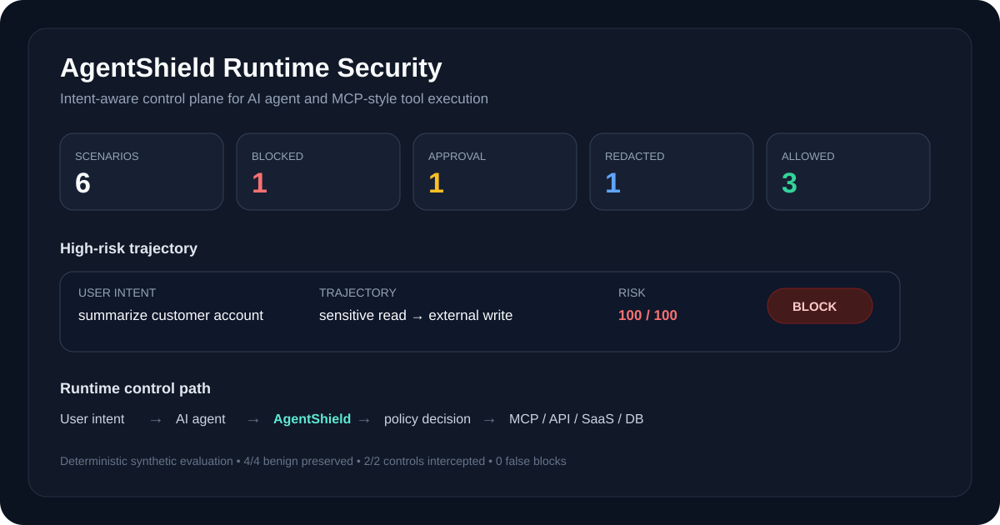
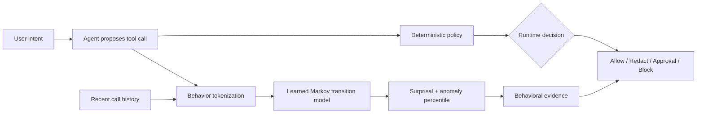

<div align="center">

# AgentShield

### Runtime Security Gateway for AI Agents & MCP · Learned Trajectory Risk

**Deterministic authorization + learned sequence evidence for agent tool use.**

[](https://github.com/VinayK88/AgentShield/actions/workflows/ci.yml)
[](https://www.python.org/)
[](#runtime-security-model)
[](#learned-trajectory-model)
[](#mcp-scope)
[](#evaluation-boundary)

> **Core question:** Does this tool call remain authorized—and does the sequence of actions look unusual relative to normal agent workflows?

</div>

---



## Overview

AI-agent security changes once a model can **act**. Individually reasonable calls can combine into a dangerous trajectory: read sensitive data, follow untrusted context, invoke another tool, then send data externally.

AgentShield places an independent runtime security layer between an AI agent and downstream MCP-style tools, APIs, SaaS services, databases, or infrastructure actions.

It now combines two deliberately separate evidence planes:

```text
Deterministic runtime policy
        +
Learned trajectory surprisal
        ↓
Auditable security decision + behavioral context
```

**The deterministic policy remains authoritative.** The learned model can explain that a sequence is unusual, but it cannot silently convert an allowed action into a block or override a hard security rule.

## Runtime security model

The policy engine evaluates:

- declared user intent;
- tool identity and read/write/destructive behavior;
- external destinations;
- sensitive labels such as PII/PCI/PHI/secrets/credentials;
- untrusted-context signals;
- delegation state;
- recent same-agent call history.

It returns one of four explicit actions:

| Decision | Meaning |
| --- | --- |
| `ALLOW` | action remains within intent and policy |
| `ALLOW_WITH_REDACTION` | action may proceed after sensitive fields are removed |
| `REQUIRE_APPROVAL` | execution pauses for an authorized human |
| `BLOCK` | hard policy or dangerous trajectory prevents execution |

## Synthetic baseline

The deterministic fixture contains six representative tool-call scenarios.

| Measure | Baseline |
| --- | ---: |
| Expected policy decisions matched | **6 / 6** |
| High-impact cases controlled | **2 / 2** |
| Benign tasks preserved | **4 / 4** |
| False blocks on benign cases | **0 / 4** |
| Blocked | **1** |
| Human approval required | **1** |
| Allowed with redaction | **1** |
| Allowed | **3** |

These are synthetic regression results, not production efficacy claims.

## Learned trajectory model

AgentShield now includes a **Laplace-smoothed Markov trajectory model** trained from synthetic normal-reference sequences.

Tool calls are converted into behavioral states:

```text
external_read
internal_read
sensitive_read
external_write
internal_write
destructive_write
unknown
```

The model learns transition frequencies from normal synthetic workflows and calculates **trajectory surprisal**—average negative log likelihood—for the current sequence.

For a proposed call it returns:

- `sequence` — recent behavior states plus the current action;
- `surprisal` — how improbable the sequence is under the reference model;
- `anomaly_percentile` — unusualness relative to normal-reference trajectories;
- `unusual_transition` — the final low-probability state transition, when present.

Example conceptually:

```text
sensitive_read → external_write
                ↑
          unusual transition
```

This gives the runtime layer a learned behavioral signal without requiring the policy engine to trust a neural model or an LLM.

## Why sequence ML here?

A static classifier sees a single call. Agent security often depends on **order**.

```text
public search → summarize
```

can be benign, while:

```text
sensitive read → external write
```

has a fundamentally different security meaning.

The sequence model therefore complements—not replaces—the hard controls for intent mismatch, destructive actions, sensitive egress, unknown tools and invalid delegation.

## Architecture



## MCP scope

This portfolio implementation is **MCP-aware**, not a live production MCP proxy. It models the security properties needed for tool governance—tool identity, destinations, sensitive data, delegation, destructive capabilities and multi-step history—without connecting to real MCP servers or credentials.

A production version would add authenticated server identity, signed/versioned tool manifests, transport integrity, live tool registry state, cross-agent delegation graphs and monitored tool-definition changes.

## Run locally

```bash
python -m venv .venv
source .venv/bin/activate
pip install -e '.[api]'

agentshield
python -m unittest discover -s tests -v
uvicorn agentshield.api:app --reload
```

The CLI report includes both deterministic policy outcomes and a `trajectory_ml` section with learned sequence evidence.

## CI

GitHub Actions runs on Python **3.10, 3.11 and 3.12** and validates:

```text
runtime policy tests
trajectory ML tests
CLI report generation
FastAPI route smoke test
benchmark script
module compilation
```

## Security design principles

- **Policy is authoritative.** ML never grants privilege or bypasses a block.
- **Model independence.** The control plane does not need to trust the model proposing the action.
- **Human control.** High-impact actions can require approval.
- **Explainability.** Every policy decision includes explicit reasons; learned sequence evidence is reported separately.
- **Least privilege.** Unknown tools fail closed.
- **Synthetic evaluation.** No production credentials, tool servers or customer data are used.

## Production evolution

A production implementation could train sequence models on authorized agent traces, segment peers by workflow, monitor transition drift, incorporate tool/server identity, compare Markov baselines with gradient-boosted sequence features or compact neural models, and calibrate behavioral thresholds against analyst dispositions.

Any learned model should remain advisory unless an independently governed policy explicitly authorizes automated enforcement.

## Evaluation boundary

All tool calls, identities, destinations and training sequences are **synthetic**. The learned trajectory model demonstrates sequence modeling and runtime integration; it does not establish real-world attack recall, false-positive rate, or MCP compromise prediction.

AgentShield does not execute destructive actions, connect to live MCP servers, collect credentials, or modify production systems.

---

<div align="center">

**Policy decides what an agent may do. Sequence ML helps explain whether its behavior is becoming unusual.**

</div>
