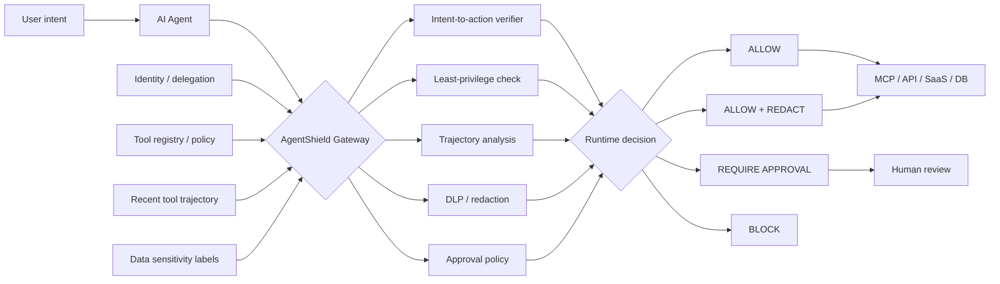

<div align="center">

# AgentShield

### Runtime Security Gateway for AI Agents & MCP

**Enforce intent-aware security policy before an AI agent can execute a tool call.**

[](https://github.com/VinayK88/AgentShield/actions/workflows/ci.yml)
[](https://www.python.org/)
[](#runtime-policy-model)
[](#security-boundary)

**Intent verification · MCP/tool policy · trajectory risk · DLP/redaction · least privilege · human approval**

[Why it exists](#why-agentshield) · [Architecture](#architecture) · [Runtime controls](#runtime-policy-model) · [Scenarios](#evaluation-scenarios) · [Quick start](#quick-start)

</div>

---

## Why AgentShield

AI-agent safety is not only a model-evaluation problem. Once an agent can call tools, query databases, send messages, modify cloud resources, or connect to MCP servers, **the execution path itself becomes a security boundary**.

AgentShield sits between an agent and its tools and answers one question before execution:

> **Should this action be allowed, redacted, escalated for approval, or blocked?**

It complements evaluation-focused systems by acting as a **runtime enforcement layer**.

| Decision | Meaning |
| --- | --- |
| `ALLOW` | Tool call matches intent, policy, and current trajectory. |
| `ALLOW_WITH_REDACTION` | Action may proceed after sensitive fields are removed. |
| `REQUIRE_APPROVAL` | A human must approve the action before execution. |
| `BLOCK` | The call violates a hard runtime control or dangerous trajectory condition. |

## What it is used for

- enforcing least privilege for agent tool use;
- detecting intent-to-action mismatch;
- stopping sensitive-data exfiltration paths;
- adding approval gates around destructive or high-impact actions;
- evaluating MCP/tool security policies with deterministic replay;
- detecting risky multi-step trajectories such as **sensitive read → external write**;
- providing explainable runtime decisions for AI governance and security review.

## Architecture



## Runtime policy model

AgentShield combines multiple independent signals rather than trusting a single classifier or model score.

| Control | Question |
| --- | --- |
| **Intent alignment** | Does the requested tool action match what the user actually asked for? |
| **Tool risk** | Is the tool external, sensitive, writable, or destructive? |
| **Data sensitivity** | Does the action context contain PII, PHI, PCI, secrets, or credentials? |
| **Trajectory risk** | Did the agent recently access sensitive data and then attempt an external write? |
| **Delegation integrity** | Is the delegation chain plausible and permitted? |
| **Human approval** | Is the action consequential enough to require explicit review? |

### Example: exfiltration trajectory

```text
User intent            summarize customer account
Step 1                 read_customer_db()
Data                    PII
Step 2                 http_post(public.example)
Untrusted context       yes

Trajectory              sensitive_read → external_write
Intent mismatch         yes
Risk score              100
Decision                BLOCK
```

### Example: destructive action

```text
User intent             check cloud resource health
Tool                     delete_cloud_resource
Observed action          delete

Destructive tool         yes
Intent mismatch          yes
Decision                 REQUIRE_APPROVAL / BLOCK
```

## Evaluation scenarios

The checked-in synthetic replay includes both risky and benign cases:

| Scenario | Expected security behavior |
| --- | --- |
| Read customer data for a summary | Allow or review based on policy |
| Upload sensitive customer data externally after untrusted input | **Block** |
| Delete production cloud resource while user asked only for health status | **Require approval / block** |
| Public web research | **Allow** |
| Send an explicitly requested customer email | **Allow** |

The point is not to maximize a toy score; it is to make **why a runtime action was permitted or denied** auditable.

## Dashboard & API

Run the local security dashboard:

```bash
pip install -e '.[api]'
uvicorn agentshield.api:app --reload
```

Open `http://127.0.0.1:8000`.

API endpoints:

`/healthz` · `/report` · `/docs`

The dashboard summarizes scenario counts, blocked actions, approval-required actions, allowed actions, risk scores, and the reasons behind each decision.

## Quick start

```bash
git clone https://github.com/VinayK88/AgentShield.git
cd AgentShield

python -m venv .venv
source .venv/bin/activate
pip install -e '.[api]'

# Run deterministic runtime-policy evaluation
agentshield

# Run tests
python -m unittest discover -s tests -v

# Start dashboard
uvicorn agentshield.api:app --reload
```

## Repository map

```text
AgentShield/
├── agentshield/
│   ├── api.py          # FastAPI dashboard + API
│   ├── cli.py          # deterministic evaluation CLI
│   ├── engine.py       # runtime policy + trajectory analysis
│   ├── fixtures.py     # synthetic agent/tool scenarios
│   ├── models.py       # typed runtime objects
│   └── report.py       # report assembly
├── tests/              # runtime-policy tests
├── .github/workflows/  # Python 3.10–3.12 CI
├── Dockerfile
├── SECURITY.md
└── README.md
```

## How it fits with the rest of the portfolio

```text
AgentAtlas
  discovers and governs agents
          ↓
AgentShield
  enforces runtime tool policy
          ↓
LLM Security Evaluation Lab
  evaluates agent/model safety
          ↓
DetectionForge
  detects security failures
          ↓
Agentic SOC Investigator
  investigates incidents
```

AgentShield is intentionally the **runtime control plane** in that chain.

## Production evolution

A production implementation would need stronger guarantees than this lab, including signed tool manifests, authenticated MCP server identity, cryptographic workload identity, policy-as-code integration, durable audit logs, enterprise DLP/classification, organization-specific approval workflows, model-independent policy enforcement, latency budgets, rate limits, sandboxing, and connectors for real agent frameworks and MCP transports.

## Security boundary

**Everything in this repository is synthetic and defensive by default.** It does not connect to real MCP servers, private SaaS accounts, production credentials, or sensitive databases. It contains no exploit automation or authorization-bypass logic.

See [`SECURITY.md`](SECURITY.md).

---

<div align="center">

### Control the action, not just the model.

**Runtime Agent Security · MCP Governance · Intent-Aware Enforcement**

</div>
