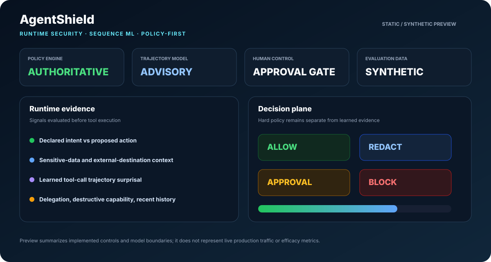
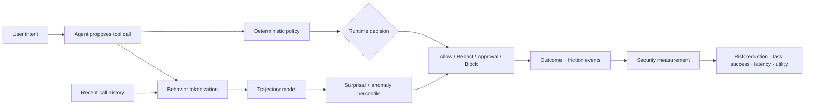

<div align="center">

# AgentShield

### Runtime Security Gateway for AI Agents & MCP · Learned Trajectory Risk · Control Measurement

**Deterministic authorization + learned sequence evidence + risk-vs-friction evaluation for agent tool use.**

[](https://github.com/VinayK88/AgentShield/actions/workflows/ci.yml)
[](https://www.python.org/)
[](#runtime-security-model)
[](#learned-trajectory-model)
[](#security-control-measurement)
[](#mcp-scope)

> **Core question:** Does the safeguard reduce risky agent behavior enough to justify the friction it introduces?

</div>

---




## Overview

AI-agent security changes once a model can **act**. Individually reasonable calls can combine into a dangerous trajectory: read sensitive data, follow untrusted context, invoke another tool, then send data externally.

AgentShield places an independent runtime security layer between an AI agent and downstream MCP-style tools, APIs, SaaS services, databases, or infrastructure actions.

It separates three concerns:

```text
Deterministic runtime policy
        +
Learned trajectory evidence
        +
Security-control measurement
        ↓
Auditable decision + behavioral context + risk/friction tradeoff
```

**The deterministic policy remains authoritative.** The learned model can explain that a sequence is unusual, but it cannot silently grant privilege or override a hard security rule.

## Runtime security model

The policy engine evaluates declared user intent, tool identity, read/write/destructive behavior, external destinations, sensitive labels, untrusted context, delegation state, and recent same-agent call history.

It returns one of four explicit actions:

| Decision | Meaning |
| --- | --- |
| `ALLOW` | action remains within intent and policy |
| `ALLOW_WITH_REDACTION` | action may proceed after sensitive fields are removed |
| `REQUIRE_APPROVAL` | execution pauses for an authorized human |
| `BLOCK` | hard policy or dangerous trajectory prevents execution |

## Synthetic policy baseline

| Measure | Baseline |
| --- | ---: |
| Expected policy decisions matched | **6 / 6** |
| High-impact cases controlled | **2 / 2** |
| Benign tasks preserved | **4 / 4** |
| False blocks on benign cases | **0 / 4** |
| Blocked | **1** |
| Human approval required | **1** |
| Allowed with redaction | **1** |
| Allowed | **3** |

These are synthetic regression results, not production efficacy claims.

## Security-control measurement

Blocking more actions is not automatically better security. A useful safeguard should reduce risky outcomes **without unnecessarily breaking legitimate agent work**.

AgentShield therefore measures the control as a security data-science system, not only as a policy engine.

Representative metrics include:

- **prevented-risk rate** — risky synthetic outcomes intercepted;
- **benign false-positive rate** — legitimate tasks unnecessarily blocked or escalated;
- **legitimate task completion** — whether safe work still succeeds;
- **approval rate and approval latency** — operational friction from human checkpoints;
- **detection latency** — how quickly risky behavior is surfaced;
- **recovery success** — whether interrupted workflows recover safely;
- **net security utility** — transparent risk reduction minus illustrative friction costs.

The repository includes a deterministic **strict-vs-adaptive safeguard experiment** plus a dependency-free bootstrap interval for the candidate-minus-baseline utility difference.

```text
Strict control                  Adaptive control
     │                               │
     ├─ risk prevented               ├─ risk prevented
     ├─ false positives              ├─ false positives
     ├─ task completion              ├─ task completion
     └─ approval latency             └─ approval latency
              \                     /
               \                   /
                → security utility ←
```

The point is not to claim a universal utility formula. The point is to make the tradeoff explicit, inspectable, and sensitivity-testable.

See `docs/security-measurement.md` for the measurement contract and production caveats.

## Learned trajectory model

AgentShield includes a **Laplace-smoothed Markov trajectory model** trained from synthetic normal-reference sequences.

Tool calls are converted into behavioral states such as:

```text
external_read
internal_read
sensitive_read
external_write
internal_write
destructive_write
unknown
```

The model learns transition frequencies from normal synthetic workflows and calculates **trajectory surprisal**—average negative log likelihood—for the current sequence.

For a proposed call it returns:

- `sequence` — recent behavior states plus the current action;
- `surprisal` — how improbable the sequence is under the reference model;
- `anomaly_percentile` — unusualness relative to normal-reference trajectories;
- `unusual_transition` — the final low-probability state transition, when present.

Example:

```text
sensitive_read → external_write
                ↑
          unusual transition
```

A static classifier sees one call. Agent security often depends on **order**, so the sequence model complements—but does not replace—hard controls.

## Architecture



## MCP scope

This portfolio implementation is **MCP-aware**, not a live production MCP proxy. It models the security properties needed for tool governance—tool identity, destinations, sensitive data, delegation, destructive capabilities, and multi-step history—without connecting to real MCP servers or credentials.

A production version would add authenticated server identity, signed/versioned tool manifests, transport integrity, live tool registry state, cross-agent delegation graphs, and monitored tool-definition changes.

## Run locally

```bash
python -m venv .venv
source .venv/bin/activate
pip install -e '.[api]'

agentshield
python -m unittest discover -s tests -v
uvicorn agentshield.api:app --reload
```

The CLI report includes policy outcomes, trajectory ML evidence, and the control-measurement experiment.

## CI

GitHub Actions validates Python **3.10, 3.11 and 3.12** across runtime policy tests, trajectory ML tests, security-measurement tests, CLI report generation, FastAPI smoke tests, benchmarking, and module compilation.

## Security design principles

- **Policy is authoritative.** ML never grants privilege or bypasses a block.
- **Model independence.** The control plane does not need to trust the model proposing the action.
- **Human control.** High-impact actions can require approval.
- **Explainability.** Policy reasons and learned evidence remain inspectable.
- **Measure friction.** A control is not considered successful merely because it blocks more.
- **Least privilege.** Unknown tools fail closed.
- **Synthetic evaluation.** No production credentials, tool servers, or customer data are used.

## Production evolution

A production implementation could train sequence models on authorized agent traces, segment peers by workflow, calibrate thresholds against analyst dispositions, run assignment-aware staged experiments, monitor control-treatment interference, sensitivity-test utility weights, add rare-severity guardrails, and track security outcomes over longer horizons.

Any learned model should remain advisory unless an independently governed policy explicitly authorizes automated enforcement.

## Evaluation boundary

All tool calls, identities, destinations, experiments, and training sequences are **synthetic**. The project demonstrates evaluation mechanics and runtime integration; it does not establish real-world attack recall, false-positive rate, or MCP compromise prediction.

AgentShield does not execute destructive actions, connect to live MCP servers, collect credentials, or modify production systems.

---

<div align="center">

**Policy decides what an agent may do. Measurement tells us whether the policy is actually helping.**

</div>
